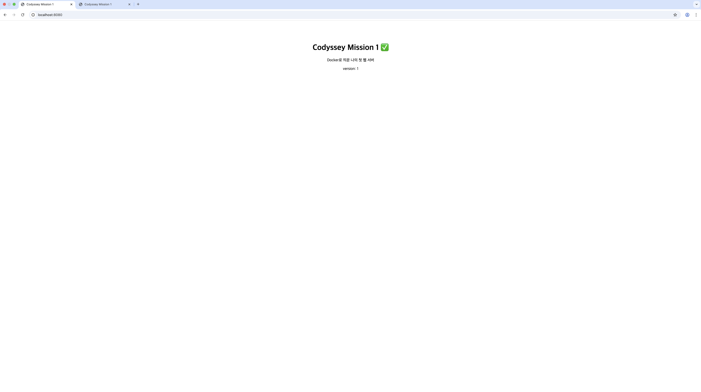
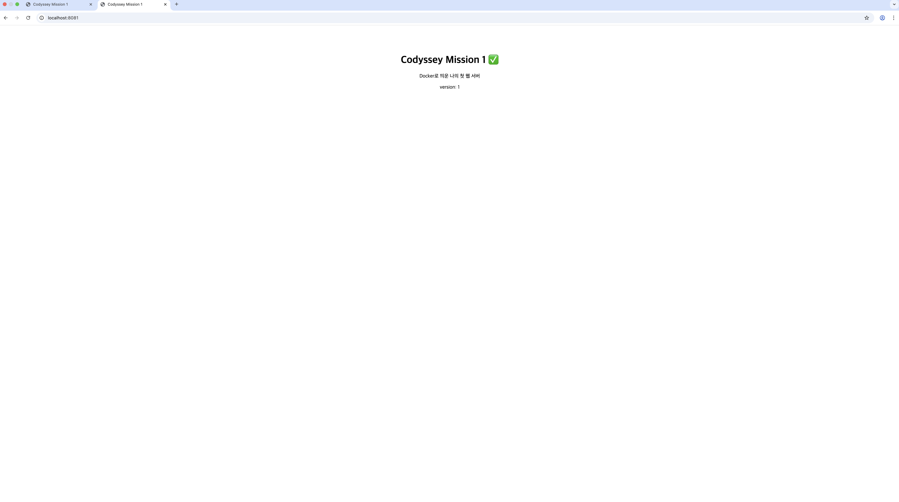
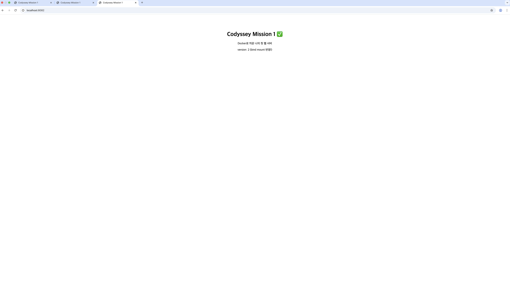
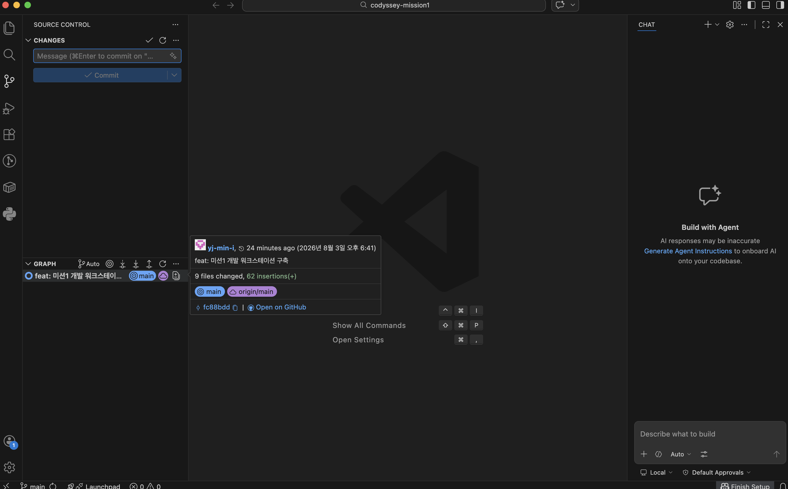

# 내 컴퓨터에 개발자용 '작업실' 꾸미기

## 1) 프로젝트 개요
터미널·Docker·Git을 직접 세팅해 "내 컴퓨터에서만 돌아가는" 문제를 줄이고,
누구나 같은 방식으로 실행·검증할 수 있는 개발 워크스테이션을 구축했다.
웹 서버를 Dockerfile로 컨테이너화하고, 포트 매핑으로 외부 접속을,
바인드 마운트로 변경 반영을, Docker 볼륨으로 데이터 영속성을 직접 검증했다.

## 2) 실행 환경
- OS: macOS 15.7.4 (24G517)
- Shell / Terminal: zsh / macOS 기본 터미널
- 컨테이너 런타임: OrbStack (sudo 권한 제약 없이 Docker 엔진 사용)
- Docker: Docker version 28.5.2, build ecc6942
- Git: git version 2.53.0
- Editor: Visual Studio Code

## 3) 폴더 구조
```
codyssey-mission1/
├── README.md
├── Dockerfile
├── .gitignore
├── site/index.html      # 컨테이너에 들어가는 정적 페이지
├── docs/
│   ├── img/             # 접속·연동 증거 스크린샷
│   └── logs.txt         # 환경/상태 조회 로그
└── practice/            # 터미널·권한 실습 (run.sh, mydir)
```

## 4) 수행 항목 체크리스트
- [x] 터미널 기본 조작 및 폴더 구성 (pwd/ls -la/cd/mkdir/touch/cp/mv/rm/cat)
- [x] 권한 변경 실습 (파일 run.sh + 디렉토리 mydir, 전/후 비교)
- [x] Docker 설치/점검 (`docker --version`, `docker info`)
- [x] Docker 기본 운영 (`images`, `ps`, `ps -a`, `logs`, `stats`)
- [x] hello-world / ubuntu 컨테이너 실행 및 내부 명령 수행
- [x] 기존 Dockerfile(nginx:alpine) 기반 커스텀 이미지 빌드 — `my-web:1.0`
- [x] 포트 매핑 접속 2회 (8080, 8081)
- [x] 바인드 마운트 변경 반영 (8082)
- [x] Docker 볼륨 영속성 검증 (컨테이너 삭제 전/후)
- [x] Git 설정 + GitHub 저장소 연동 + VSCode 연동
- [x] (보너스) Docker Compose 멀티 컨테이너 + 서비스 디스커버리 확인

## 5) 검증 방법 요약
| 항목 | 검증 명령 | 확인한 내용 | 증거 위치 |
|---|---|---|---|
| 권한 | `ls -l`, `chmod`, `./run.sh` | 755에서 실행 성공, 644에서 permission denied | 6-2 |
| Docker 데몬 | `docker info` | Server Version 정상 출력 | 6-3 |
| 커스텀 이미지 | `docker build`, `docker images` | my-web:1.0 (62.4MB) 생성 | 6-5 |
| 포트 매핑 | 브라우저 접속, `curl` | 8080·8081 동일 페이지 응답 | docs/img/port-8080.png, port-8081.png |
| 바인드 마운트 | 호스트 파일 수정 후 재요청 | 재빌드 없이 version 1 → 2 변경 | 6-7, docs/img/port-8082.png |
| 볼륨 영속성 | 컨테이너 삭제 후 재연결 `cat` | 삭제 후에도 /data/hello.txt 유지 | 6-8 |
| GitHub 연동 | VSCode Source Control | main 브랜치·계정 연동 확인 | docs/img/vscode-github.png |

## 6) 수행 로그

### 6-1. 터미널 기본 조작
```bash
$ cd ~/codyssey-mission1/practice
$ pwd
/Users/bellayjm061635/codyssey-mission1/practice
$ ls -la
total 16
drwxr-xr-x  6 bellayjm061635  bellayjm061635  192  8  3 17:27 .
drwxr-xr-x  8 bellayjm061635  bellayjm061635  256  8  3 18:41 ..
-rw-r--r--  1 bellayjm061635  bellayjm061635   15  8  3 17:17 hello.txt
drwxr-xr-x  2 bellayjm061635  bellayjm061635   64  8  3 17:27 mydir
-rw-r--r--  1 bellayjm061635  bellayjm061635   28  8  3 17:27 run.sh
drwxr-xr-x  2 bellayjm061635  bellayjm061635   64  8  3 17:18 sub

$ mkdir -p sub
$ touch hello.txt
$ echo "hello codyssey" > hello.txt
$ cat hello.txt
hello codyssey

$ cp hello.txt hello_copy.txt
$ ls -la
total 24
drwxr-xr-x  7 bellayjm061635  bellayjm061635  224  8  3 19:45 .
drwxr-xr-x  8 bellayjm061635  bellayjm061635  256  8  3 18:41 ..
-rw-r--r--  1 bellayjm061635  bellayjm061635   15  8  3 19:45 hello_copy.txt
-rw-r--r--  1 bellayjm061635  bellayjm061635   15  8  3 19:45 hello.txt
drwxr-xr-x  2 bellayjm061635  bellayjm061635   64  8  3 17:27 mydir
-rw-r--r--  1 bellayjm061635  bellayjm061635   28  8  3 17:27 run.sh
drwxr-xr-x  2 bellayjm061635  bellayjm061635   64  8  3 17:18 sub

$ mv hello_copy.txt sub/renamed.txt
$ ls -la sub
total 8
drwxr-xr-x  3 bellayjm061635  bellayjm061635   96  8  3 19:45 .
drwxr-xr-x  6 bellayjm061635  bellayjm061635  192  8  3 19:45 ..
-rw-r--r--  1 bellayjm061635  bellayjm061635   15  8  3 19:45 renamed.txt

$ rm sub/renamed.txt
$ ls -la sub
total 0
drwxr-xr-x  2 bellayjm061635  bellayjm061635   64  8  3 19:45 .
drwxr-xr-x  6 bellayjm061635  bellayjm061635  192  8  3 19:45 ..

$ cd ~/codyssey-mission1
$ pwd
/Users/bellayjm061635/codyssey-mission1

$ cd practice
$ pwd
/Users/bellayjm061635/codyssey-mission1/practice

$ cd ..
$ pwd
/Users/bellayjm061635/codyssey-mission1
```
절대경로는 `/Users/.../codyssey-mission1` 처럼 최상위부터의 전체 주소라 현재 위치와 무관하게
같은 곳을 가리키고, 상대경로는 `site`, `../practice` 처럼 현재 위치를 기준으로 해석된다.

### 6-2. 권한 변경 (전 / 후)
```bash
$ ls -l run.sh
-rw-r--r--  1 bellayjm061635  bellayjm061635  28  8  3 17:27 run.sh
$ ls -ld mydir
drwxr-xr-x  2 bellayjm061635  bellayjm061635  64  8  3 17:27 mydir
$ chmod 755 run.sh
$ ls -l run.sh
-rwxr-xr-x  1 bellayjm061635  bellayjm061635  28  8  3 17:27 run.sh
$ ./run.sh
권한 실습 성공
$ chmod 644 run.sh
$ ls -l run.sh
-rw-r--r--  1 bellayjm061635  bellayjm061635  28  8  3 17:27 run.sh
$ ./run.sh
zsh: permission denied: ./run.sh
```
`r`=4, `w`=2, `x`=1을 소유자/그룹/기타 순으로 더한 3자리 표기다.
755 = 소유자 rwx, 그룹·기타 r-x. 644 = 소유자 rw-, 그룹·기타 r--.
디렉토리의 `x` 는 내부 진입 권한을 의미하므로 폴더는 보통 755를 쓴다.

### 6-3. Docker 설치 및 점검
```bash
$ docker info | grep -E "Server Version|Operating System|Containers|Images"
 Containers: 5
 Images: 4
 Server Version: 28.5.2
 Operating System: OrbStack
```

### 6-4. Docker 기본 운영 및 컨테이너 실행
```bash
$ docker images
REPOSITORY    TAG       IMAGE ID       CREATED          SIZE
my-web        1.0       6602f1c40bc8   33 minutes ago   62.4MB
nginx         alpine    f0ba77f796e5   2 weeks ago      62.4MB
ubuntu        22.04     b8e6b596a324   4 weeks ago      78.1MB
hello-world   latest    e2ac70e7319a   4 months ago     10.1kB

$ docker ps -a
CONTAINER ID   IMAGE          COMMAND                   STATUS                         PORTS                                     NAMES
4ae2df0656e7   my-web:1.0     "/docker-entrypoint.…"   Up 18 minutes (healthy)        0.0.0.0:8082->80/tcp                     my-web-mount
97ff82844ceb   my-web:1.0     "/docker-entrypoint.…"   Up 29 minutes (healthy)        0.0.0.0:8081->80/tcp                     my-web-8081
c2cae3341148   my-web:1.0     "/docker-entrypoint.…"   Up 29 minutes (healthy)        0.0.0.0:8080->80/tcp                     my-web-8080
8bffcd28cce2   ubuntu:22.04   "bash"                    Up 58 minutes                                                            my-ubuntu
bb920726c1af   hello-world    "/hello"                  Exited (0)                                                               affectionate_dubinsky

$ docker logs --tail 5 4ae2df0656e7
::1 - - [03/Aug/2026:10:33:30 +0000] "GET / HTTP/1.1" 200 317 "-" "Wget" "-"
::1 - - [03/Aug/2026:10:34:00 +0000] "GET / HTTP/1.1" 200 317 "-" "Wget" "-"
::1 - - [03/Aug/2026:10:34:30 +0000] "GET / HTTP/1.1" 200 317 "-" "Wget" "-"
::1 - - [03/Aug/2026:10:35:00 +0000] "GET / HTTP/1.1" 200 317 "-" "Wget" "-"
::1 - - [03/Aug/2026:10:35:30 +0000] "GET / HTTP/1.1" 200 317 "-" "Wget" "-"

$ docker stats --no-stream
CONTAINER ID   NAME           CPU %     MEM USAGE / LIMIT     MEM %
4ae2df0656e7   my-web-mount   0.00%     5.691MiB / 15.67GiB   0.04%
97ff82844ceb   my-web-8081    0.00%     5.719MiB / 15.67GiB   0.04%
c2cae3341148   my-web-8080    0.00%     5.844MiB / 15.67GiB   0.04%
8bffcd28cce2   my-ubuntu      0.00%     568KiB / 15.67GiB     0.00%

$ docker run hello-world
Hello from Docker!
This message shows that your installation appears to be working correctly.

$ docker exec -it my-ubuntu bash -lc "pwd; ls; echo 안녕 컨테이너; cat /etc/os-release"
/
bin   dev  home  lib32 libx32 mnt  proc  run srv  tmp  var
boot  etc  lib   lib64 media  opt  root  sbin sys  usr
안녕 컨테이너
PRETTY_NAME="Ubuntu 22.04.5 LTS"
NAME="Ubuntu"
VERSION_ID="22.04"
```
attach와 exec의 차이: `run -it`/`attach` 는 컨테이너의 메인 프로세스에 연결되므로
`exit` 시 컨테이너까지 종료된다. `exec` 는 살아있는 컨테이너에 별도 프로세스를 띄우므로
`exit` 해도 컨테이너는 실행 상태를 유지한다.

### 6-5. Dockerfile 및 커스텀 이미지
```dockerfile
FROM nginx:alpine
LABEL org.opencontainers.image.title=my-web
LABEL maintainer=yj-min-i
ENV APP_ENV=dev
COPY site/ /usr/share/nginx/html/
EXPOSE 80
HEALTHCHECK --interval=30s --timeout=3s CMD wget -q --spider http://localhost/ || exit 1
```
- 선택한 기존 베이스: `nginx:alpine` — 공식 웹서버 이미지이며 alpine 기반으로 용량이 작아 빌드가 빠르다.
- 커스텀 포인트와 목적:
  - `LABEL` — 이미지 이름/작성자 메타데이터를 남겨 식별 가능하게 함
  - `ENV APP_ENV=dev` — 설정을 코드에서 분리해 환경별로 바꿀 수 있게 함
  - `COPY site/` — 기본 페이지를 내가 만든 정적 콘텐츠로 교체
  - `EXPOSE 80` — 컨테이너가 사용하는 포트를 문서화
  - `HEALTHCHECK` — 컨테이너가 정상 응답하는지 주기적으로 자동 점검
```bash
$ docker build -t my-web:1.0 .
[+] Building 0.9s (7/7) FINISHED                                docker:orbstack
 => [internal] load build definition from Dockerfile                       0.1s
 => => transferring dockerfile: 276B                                       0.0s
 => [internal] load metadata for docker.io/library/nginx:alpine            0.0s
 => [internal] load .dockerignore                                          0.1s
 => => transferring context: 2B                                            0.0s
 => [internal] load build context                                          0.1s
 => => transferring context: 389B                                          0.0s
 => CACHED [1/2] FROM docker.io/library/nginx:alpine                       0.0s
 => [2/2] COPY site/ /usr/share/nginx/html/                                0.1s
 => exporting to image                                                     0.2s
 => => writing image sha256:4e1fbdb30488b9ba2e368a4c1262f936cd73dd8a8ffe3  0.0s
 => => naming to docker.io/library/my-web:1.0                              0.0s

$ docker images | grep my-web
my-web   1.0   4e1fbdb30488   1 second ago   62.4MB
```
재빌드 시 `CACHED [1/2] FROM nginx:alpine` 로 베이스 이미지 레이어가 재사용되어 약 1초 만에 완료되었다.

### 6-6. 포트 매핑 및 접속 증거
```bash
$ docker run -d -p 8080:80 --name my-web-8080 my-web:1.0
$ docker run -d -p 8081:80 --name my-web-8081 my-web:1.0
$ docker ps
CONTAINER ID   IMAGE          COMMAND                   STATUS                 PORTS                                     NAMES
4ae2df0656e7   6602f1c40bc8   "/docker-entrypoint.…"   Up 2 hours (healthy)   0.0.0.0:8082->80/tcp                     my-web-mount
97ff82844ceb   6602f1c40bc8   "/docker-entrypoint.…"   Up 2 hours (healthy)   0.0.0.0:8081->80/tcp                     my-web-8081
c2cae3341148   6602f1c40bc8   "/docker-entrypoint.…"   Up 2 hours (healthy)   0.0.0.0:8080->80/tcp                     my-web-8080
8bffcd28cce2   ubuntu:22.04   "bash"                    Up 2 hours                                                       my-ubuntu
$ curl http://localhost:8080
<!DOCTYPE html>
  <html lang="ko">
  <head><meta charset="utf-8"><title>Codyssey Mission 1</title></head>
  <body style="font-family:sans-serif;text-align:center;padding:60px">
    <h1>Codyssey Mission 1 ✅</h1>
    <p>Docker로 띄운 나의 첫 웹 서버</p>
    <p id="v">version: 1</p>
  </body>
  </html>
$ curl http://localhost:8081
<!DOCTYPE html>
  <html lang="ko">
  <head><meta charset="utf-8"><title>Codyssey Mission 1</title></head>
  <body style="font-family:sans-serif;text-align:center;padding:60px">
    <h1>Codyssey Mission 1 ✅</h1>
    <p>Docker로 띄운 나의 첫 웹 서버</p>
    <p id="v">version: 1</p>
  </body>
  </html>
```



포트 매핑이 필요한 이유: 컨테이너는 격리된 자체 네트워크를 갖기 때문에 내부 80번 포트가
호스트에서 그대로 보이지 않는다. `-p 호스트:컨테이너` 로 통로를 열어야 접속되며,
컨테이너 포트가 같아도 호스트 포트만 다르게 주면 같은 이미지를 여러 개 동시에 띄울 수 있다.

### 6-7. 바인드 마운트 변경 반영 (전 / 후)
```bash
$ docker run -d -p 8082:80 -v "$(pwd)/site:/usr/share/nginx/html" --name my-web-mount my-web:1.0
$ curl http://localhost:8082 | grep version     # 전
<p id="v">version: 1</p>
$ sed -i '' 's/version: 1/version: 2 (bind mount 반영!)/' site/index.html
$ curl http://localhost:8082 | grep version     # 후
<p id="v">version: 2 (bind mount 반영!)</p>
```


이미지를 재빌드하지 않았는데도 내용이 바뀌었다. 바인드 마운트는 호스트 폴더를 컨테이너 안에
그대로 연결하므로 개발 중 코드 변경이 즉시 반영된다.

### 6-8. Docker 볼륨 영속성 검증
```bash
$ docker volume create mydata
$ docker run -d --name vol-test -v mydata:/data ubuntu:22.04 sleep infinity
$ docker exec -it vol-test bash -lc "echo 'persist me' > /data/hello.txt && cat /data/hello.txt"
persist me
$ docker rm -f vol-test
$ docker run -d --name vol-test2 -v mydata:/data ubuntu:22.04 sleep infinity
$ docker exec -it vol-test2 bash -lc "cat /data/hello.txt"
persist me
```
컨테이너를 삭제해도 볼륨의 데이터는 남아 새 컨테이너에 다시 연결된다.
바인드 마운트는 개발 중 코드 반영용, 볼륨은 DB처럼 사라지면 안 되는 데이터 보관용이다.

### 6-9. Git 설정 및 GitHub / VSCode 연동
```bash
$ git config --list
credential.helper=osxkeychain
user.name=yj-min-i
user.email=bellayjm06@naver.com
init.defaultbranch=main
```


Git과 GitHub의 차이: Git은 내 컴퓨터에서 변경 이력을 기록·복원하는 로컬 버전관리 도구이고,
GitHub은 그 저장소를 원격에 두고 백업·공유·협업(PR, 이슈)하게 해주는 웹 플랫폼이다.

## 7) 트러블슈팅
### T1. heredoc 종료 실패로 Dockerfile이 생성되지 않음
- **문제**: `docker build` 실행 시 `failed to read dockerfile: open Dockerfile: no such file or directory`
- **원인 가설**: `cat > Dockerfile << 'EOF'` 에서 종료 토큰 `EOF` 가 마지막 명령과 같은 줄에 붙어 있어
  입력이 끝나지 않았고, 이후 붙여넣은 build 명령들이 실행되지 않고 파일 내용으로 흘러 들어갔다.
  프롬프트가 `%` 대신 `heredoc>` 으로 유지된 것이 단서였다.
- **확인**: `cat Dockerfile` → `No such file or directory`. `transferring dockerfile: 2B` 로
  내용이 비어 있음도 확인.
- **해결**: `Control + C` 로 입력 모드를 탈출한 뒤, heredoc 대신 `echo '...' >> Dockerfile` 로
  한 줄씩 작성. `cat Dockerfile` 로 7줄을 검증한 후 빌드 성공(`transferring dockerfile: 276B`).
- **대안**: 여러 줄 파일은 VSCode(`code Dockerfile`)에서 작성 후 저장하는 방식이 더 안전하다.

### T2. 스마트 따옴표(`”`)로 인한 셸 인용 미종료
- **문제**: `LABEL maintainer="yj-min-i”` 입력 후 프롬프트가 계속 입력 대기 상태로 유지됨
- **원인 가설**: 여는 따옴표는 곧은 `"` 인데 닫는 따옴표가 둥근 `”` 로 입력되어
  셸이 인용 부호의 짝을 찾지 못했다.
- **확인**: 입력한 줄을 다시 보니 앞뒤 따옴표 모양이 다름
- **해결**: 따옴표가 필요 없는 형태(`LABEL maintainer=yj-min-i`)로 재작성. 이후 정상 빌드.

### T3. 컨테이너 내부 프롬프트를 셸 오류로 오인해 터미널을 강제 종료
- **문제**: `docker run -it ubuntu:22.04 bash` 이후 익숙한 `%` 프롬프트가 사라지고
  `root@...:/#` 만 표시되어 터미널을 강제 종료했다.
- **원인 가설**: 컨테이너 내부 셸에 접속된 상태이며, 종료 방법은 `exit` 다.
- **확인**: `docker ps -a` 로 강제 종료 후에도 컨테이너가 남아 있는 것을 확인
- **해결**: `exit` 로 정상 이탈하는 것으로 습관을 교정하고, 남은 컨테이너는
  `docker rm -f my-ubuntu` 로 정리. 터미널 창을 닫아도 파일·이미지·컨테이너는 디스크에 남지만
  화면 출력 로그는 사라지므로, 이후 조회 결과는 `| tee -a docs/logs.txt` 로 파일에 함께 저장했다.

## 8) 재현 방법
```bash
git clone https://github.com/yj-min-i/codyssey-mission1.git
cd codyssey-mission1
docker build -t my-web:1.0 .
docker run -d -p 8080:80 --name my-web-8080 my-web:1.0
open http://localhost:8080
```
- 환경 의존 사항: 이 프로젝트는 macOS + OrbStack에서 수행했다. OrbStack 앱이 실행 중이어야
  `docker` 명령이 동작한다. Docker Desktop이나 Linux의 Docker Engine에서도 동일하게 동작한다.
- 경로 의존 사항: 바인드 마운트는 절대경로가 필요하므로 고정 경로 대신
  `-v "$(pwd)/site:/usr/share/nginx/html"` 로 작성해 어느 위치에서 clone해도 동작하게 했다.

## 9) 보안 / 개인정보
- 토큰·비밀번호·개인키·인증 코드는 문서, 로그, 스크린샷에 포함하지 않았다.
- `.gitignore` 에 `.DS_Store`, `*.log`, `.env`, `*.pem` 을 등록했다.
- GitHub 인증은 브라우저 승인(또는 만료 기간을 설정한 토큰)으로 처리했고 토큰 값은 기록하지 않았다.

## 10) 학습 정리
1. **절대경로 / 상대경로** — 절대경로는 `/` 부터의 전체 주소로 현재 위치와 무관하고,
   상대경로는 현재 위치 기준이라 `cd` 결과에 따라 가리키는 대상이 달라진다.
2. **권한과 755 / 644** — r=4, w=2, x=1을 소유자·그룹·기타 순으로 더한 값.
   755는 소유자만 수정·실행, 644는 소유자만 수정 가능하고 나머지는 읽기만 가능하다.
3. **커스텀 이미지** — 공식 이미지를 `FROM` 으로 상속받고 필요한 부분만 덧붙여
   빠르고 재현 가능한 이미지를 만든다.
4. **포트 매핑** — 격리된 컨테이너 네트워크를 호스트와 연결하는 통로.
   호스트 포트를 달리하면 동일 이미지를 동시에 여러 개 띄울 수 있다.
5. **Docker 볼륨** — 컨테이너 생명주기와 분리된 저장 공간으로,
   컨테이너를 삭제해도 데이터가 유지된다.
6. **Git / GitHub** — Git은 로컬 버전관리 도구, GitHub은 원격 백업·공유·협업 플랫폼.

## 11) 보너스 — Docker Compose 기초 / 멀티 컨테이너
Docker Compose로 웹 서버(`web`)와 보조 서비스(`cache`) 2개 컨테이너를 함께 실행하고,
서비스 이름만으로 컨테이너 간 네트워크 통신이 가능한지 확인했다.

```yaml
services:
  web:
    build: .
    image: my-web:1.0
    ports:
      - "8090:80"
    volumes:
      - ./site:/usr/share/nginx/html
    environment:
      - APP_ENV=dev
  cache:
    image: redis:alpine
```

```bash
$ docker compose up -d
[+] Running 3/3
 ✔ Network codyssey-mission1_default    Created
 ✔ Container codyssey-mission1-cache-1  Started
 ✔ Container codyssey-mission1-web-1    Started

$ docker compose ps
NAME                        IMAGE          SERVICE   STATUS                                     PORTS
codyssey-mission1-cache-1   redis:alpine   cache     Up                                          6379/tcp
codyssey-mission1-web-1     my-web:1.0     web       Up (healthy)                                0.0.0.0:8090->80/tcp

$ docker compose logs web
web-1  | /docker-entrypoint.sh: Configuration complete; ready for start up
web-1  | 2026/08/03 11:34:23 [notice] 1#1: nginx/1.31.3
web-1  | 2026/08/03 11:34:23 [notice] 1#1: start worker processes

$ docker exec -it $(docker compose ps -q web) sh -lc "ping -c 2 cache"
PING cache (192.168.97.3): 56 data bytes
64 bytes from 192.168.97.3: seq=0 ttl=64 time=0.055 ms
64 bytes from 192.168.97.3: seq=1 ttl=64 time=0.068 ms

--- cache ping statistics ---
2 packets transmitted, 2 packets received, 0% packet loss
round-trip min/avg/max = 0.055/0.061/0.068 ms
```

배움 포인트: 길게 외우던 `docker run` 옵션들이 파일로 문서화된 실행 설정이 되어
재현이 쉬워졌다. 또한 서비스 이름(`cache`)만으로 컨테이너를 찾아 통신할 수 있었는데(0% packet loss),
이는 Compose가 자동으로 만드는 내부 네트워크의 서비스 디스커버리 덕분이다.
